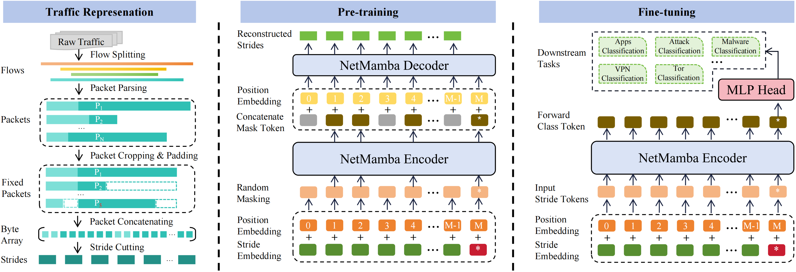

<div align="center">
<h1>NetMamba </h1>
<h3>Efficient Network Traffic Classification via Pre-training Unidirectional Mamba</h3>

[Tongze Wang](https://github.com/wangtz19), [Xiaohui Xie](https://thuxiexiaohui.github.io/), [Wenduo Wang](https://github.com/Viz7), [Chuyi Wang](https://github.com/Judy456abc), [Youjian Zhao](https://www.cs.tsinghua.edu.cn/info/1126/3576.htm), [Yong Cui](https://www.cuiyong.net/index.html)

ICNP 2024 ([arXiv paper](https://arxiv.org/abs/2405.11449))
</div>

## Overview
<div align="center">

</div>

## Environment Setup
- Create python environment
    - `conda create -n NetMamba python=3.10.13`
    - `conda activate NetMamba`
- Install PyTorch 2.1.1+cu121 (we conduct experiments on this version)
    - `pip install torch==2.1.1 torchvision==0.16.1 --index-url https://download.pytorch.org/whl/cu121`
- Install Mamba 1.1.1
    - `cd mamba-1p1p1`
    - `pip install -e .`
- Install other dependent libraries
    - `pip install -r requirements.txt`

## Data Preparation
### Download our processed datasets
For simplicity, you are welcome to download our processed datasets on which our experiments are conducted from [google drive](https://drive.google.com/drive/folders/1C1urXBhk09V7Z80Kk5JYuP7QeXiedUIl?usp=sharing). 

Each dataset is organized into the following structure:
```text
.
|-- train
|   |-- Category 1
|   |   |-- Sample 1
|   |   |-- Sample 2
|   |   |-- ...
|   |   `-- Sample M
|   |-- Category 2
|   |-- ...
|   `-- Catergory N
|-- test
`-- valid
```
### Process your own datasets
If you'd like to generate customized datasets, please refer to preprocessing scripts provided in [dataset](https://github.com/wangtz19/NetMamba/tree/main/dataset). Note that you need to change several file paths accordingly.

## Run NetMamba
- Run pre-training: 
```shell
CUDA_VISIBLE_DEVICES=0 python src/pre-train.py \\
    --batch_size 128 \\
    --blr 1e-3 \\
    --steps 150000 \\
    --mask_ratio 0.9 \\
    --data_path <your-dataset-dir> \\
    --output_dir <your-output-dir> \\
    --log_dir <your-output-dir> \\
    --model net_mamba_pretrain \\
    --no_amp
```
- Run fine-tuning (including evaluation)
```shell
CUDA_VISIBLE_DEVICES=0 python src/fine-tune.py \\
    --blr 2e-3 \\
    --epochs 120 \\
    --nb_classes <num-class> \\
    --finetune <pretrain-checkpoint-path> \\
    --data_path <your-dataset-dir> \\
    --output_dir <your-output-dir> \\
    --log_dir <your-output-dir> \\
    --model net_mamba_classifier \\
    --no_amp
```
Note that you should replace variable in the `< >` format with your actual values.

## Checkpoint
The pre-trained checkpoint of NetMamba is available for download on our [huggingface repo](https://huggingface.co/wangtz/NetMamba). Feel free to access it at your convenience. If you require any other type of checkpoints, please contact us via email (wangtz23@mails.tsinghua.edu.cn).

## Citation
```
@misc{wang2024netmamba,
      title={NetMamba: Efficient Network Traffic Classification via Pre-training Unidirectional Mamba}, 
      author={Tongze Wang and Xiaohui Xie and Wenduo Wang and Chuyi Wang and Youjian Zhao and Yong Cui},
      year={2024},
      eprint={2405.11449},
      archivePrefix={arXiv},
      primaryClass={cs.LG}
}
```